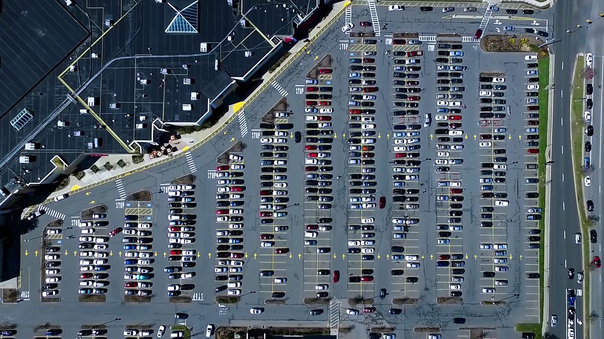

# parking-navigation

---

> 这里重新修改了项目结构，由于之前的为了完成课设，将 **空车位识别** 与 **最短路寻路** 混合，导致项目混乱，以及由于将 `torch` 训练的模型存入仓库，导致仓库很难 `clone`，这里重新整理该项目。

稍微实际一点场景下的而最短路寻路，主要是对于 **点** 和 **边** 的建模，对于基于道路联通的情况下，往往使用 (我自己猜的) **道路分叉点** 作为 **点(Node)** 会是很好的解决办法，然后这样情况下，**边(Edge)** 也被我们建模出来了，**就是两个相连分叉点之间的道路**。

可行性：上述建模的可行性依赖于：

* 大部分道路较为笔直，这样形成的交叉点的数目最多是 **道路个数 x 道路个数** ；
* 精度要求不高，因为为了简化问题，一般我们只会在地图某个 scale 下讨论最短路问题，例如，你只会在 **一个市区的地图** 讨论你家到附近奶茶店的最短路，而不会在 **一个世界地图里** 讨论你家到附近奶茶店的最短距离，这种情况下，需要的道路数目并不太多，因此整个 **图** 其实规模不大，而你依然能得到最优解，其中精度的丢失来源于 scale 的选择。

---

而具体到本项目，一个停车场的 scale，那显然采取这种方式是可行的，因为 `dijkstra` 可以达到 $m\log n$ ($m$ 边数，$n$ 点数)，对于一个规模正常的停车场，我们完全可以使用 `dijkstra` 在 $1s$ 规划出最优秀路径，这种设计方式的一个缺点是，当同时访问用户量过大，而 **cpu** 吞吐量有限的情况下，整体延迟会增大。

> 实际情况下，也许考虑删去大部分冗余的点和边

本项目讨论如下露天停车场的寻路，即，对于一个入口，找到当前最近的空车位，并返回一个规划路径：

首先介绍主要文件：

* `main.py` : 生成所有 **点，边** ，以及寻找 **空车位位置** 将其存在 `./config` 文件夹下
  * 获取道路分叉点，采用的方式是人工手工标注，结果可以参考 `./saveimg/raw.jpg` 下的形式，然后代码里采用识别绿点以及红线的策略，具体实现方式建议参阅代码。

* `upd.py` : 根据输入一张当前遥感卫星拍摄的图片，来更新对应车位是否有车，或者没车
* `Graph.py` : 使用 `dijkstra` 得到离当前起点 (本项目规定 `0，1` 分别是位于左，右边的入口) 最近的空车位的位置，并输出规划路径的图片

其次是：

* `detection` : 检测车位位置是否为空，基于深度学习，其实对于这个简单问题不需要深度学习也可以很好，我偷懒了，用了 `resnet`.
* `model` ：点的建模
* `utils` : 存储 `main.py` 所需的工具
* `saveimg`：存储稀少的遥感卫星露天停车场的素材，你可以生成更多素材，一种方式是，截取一个车位的图像，然后将其覆盖到其它空车的位置

## Run

首先下载 `https://1drv.ms/u/s!Avz63L6xEcuNgSCKqm3JowjJ_XdE?e=ZNgRWc` 里的文件，放置到 `./detection/Trained` 目录下。

* 单独运行 `main.py` 生成点，边
* 单独运行 `upd.py` 更新每个车位是否有车的信息
* 单独运行 `Graph.py` 默认得到距离左边入口最近的空车位的路径规划

